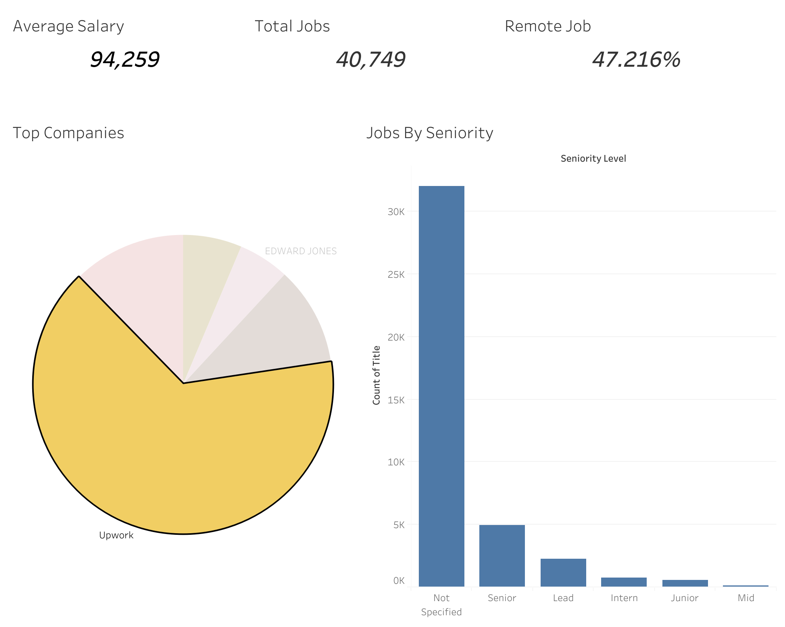
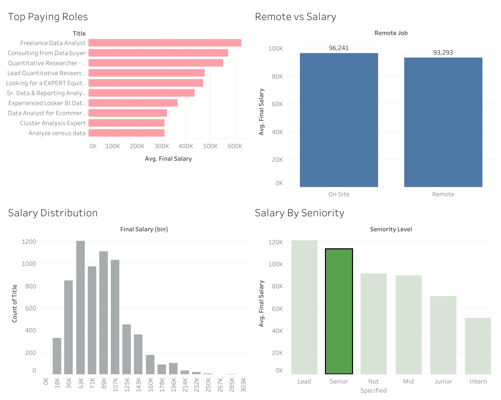

# Job Market Analysis Project

## Overview

This project analyzes job market trends using scraped job posting data.  
The analysis focuses on:

- remote work trends
- salary estimation
- seniority distribution
- hiring activity
- geographic patterns

The project includes:
- data cleaning
- feature engineering
- exploratory data analysis (EDA)
- SQL export
- Tableau dashboards
- basic machine learning

---

# Tools & Technologies

- Python
- Pandas
- NumPy
- Regex
- Matplotlib
- Seaborn
- SQLite
- Scikit-learn
- Tableau

---

# Project Workflow

## 1. Data Cleaning

The dataset required several preprocessing steps:

- handling missing values
- removing duplicates
- standardizing text columns
- cleaning salary information
- fixing inconsistent categories

## 2. Feature Engineering

| Feature | Description |
|---|---|
| `seniority_level` | Extracted from job titles |
| `remote_job` | Created using title, location and work-from-home indicators |
| `salary_estimate` | Estimated salary extracted from raw salary text |
| `final_salary` | Final salary column created using fallback salary logic |

## 3. Exploratory Data Analysis

The analysis explored:
- remote vs onsite jobs
- salary distributions
- hiring activity
- top companies
- seniority trends

### Key Insights

- Remote jobs represented a significant share of total job postings.
- Mid-level and senior-level roles dominated the dataset.
- Salary distribution was heavily right-skewed with several high-paying outliers.
- A small number of companies accounted for a large share of hiring activity.
- Remote positions showed different salary patterns compared to onsite jobs.
- Salary prediction performance was limited due to missing information such as technical skills and years of experience.

---

# Tableau Dashboards

## Job Market Overview



## Salary Analysis



The dashboards were created in Tableau to visualize:
- remote work trends
- hiring activity
- salary distribution
- seniority levels
- top companies
- salary comparisons

---

# Machine Learning

A simple Random Forest regression model was trained to predict estimated salaries using structured job posting features.

### Features Used
- location
- schedule type
- seniority level
- remote job indicator
- job platform (`via`)

### Model Performance
- MAE: ~6200
- R² Score: ~0.05

The model achieved limited predictive performance, suggesting that salary estimation depends on many additional variables not present in the dataset.

The purpose of the ML section was to demonstrate a basic machine learning workflow:
- preprocessing
- feature encoding
- train/test split
- model training
- prediction
- evaluation


# Limitations

- Salary information was missing for many postings.
- Salary estimation was approximate and based on available structured data.
- Some duplicated or reposted job listings may still remain.


Author

Semyon Sidorov

---

# Project Structure

```text
Job-Market-Analysis/
│
├── data/
│   ├── raw/
│   └── processed/
│
├── notebooks/
│
├── sql/
│
├── images/
│
├── README.md
│
└── requirements.txt


